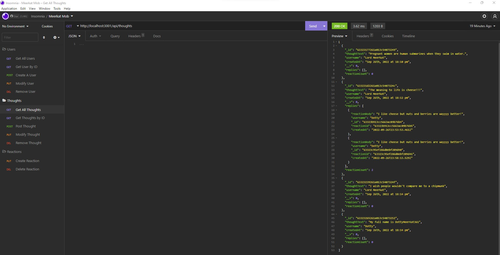

# meerkat-mob-social

## Table of Contents

- [Project Description](#Description)
- [Installation](#Installation)
- [Usage](#Usage)
- [GitHub](#GitHub)
- [Contact Me](#ContactMe)
- [View My Video](#ViewMyVideo)

## Description

### Motivation for creating this project

I built this platform to display my ability to create and setup the backend for websites using NoSQL (I used mongoose for this project). Billions of people use the internet daily so if I can display my many talents, I can show off my worth.

### What problem does this solve?

This repo is great for anybody using a large data or will have an evolving data structure unlike if I was to create this project with SQL, which requires more structure. Users, thoughts, and other aspects can be quickly added without losing any data.

## Installation

In order to download and use my code, you will have to clone my repo and install express and mongoose. After downloading my code just run "npm install" for a speedy installation.

## Usage

Keep up to date with all of the latest news stories with your friends families and associates. This will allow you to allows be in the "know" in an eventful world.

## Contact Me

See other projects I have created at https://github.com/DouglasRed

Contact me at douglasred63@yahoo.com for any questions you have about my project.

## View My Video

View my video of this project here https://youtu.be/ZLT35XTyw-Q on youtube. The link is required to view the video.
